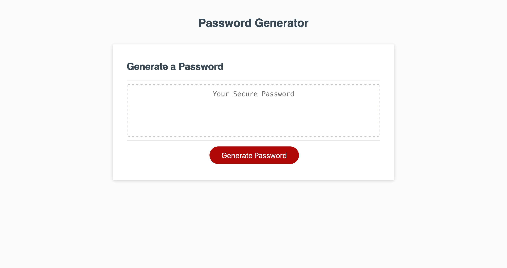
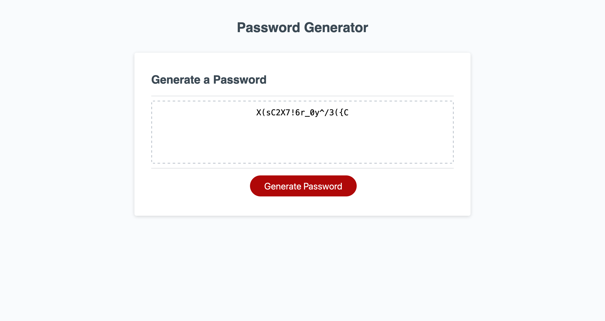

# Password Generator
## Description
This website consists of a random password generator that generates password based on user criterion. A prompt box is used for user input which is then sorted out to produce the random password through JavaScript. The user can choose whether or not they want uppercase, lowercase, numbers, or symbols. Upon clicking the "Generate Password" button, the password is generated dynamically. People often choose weak passwords and reuse them across websites. This leads to loss of security. By using this password generator, a strong password can be chosen that is less prone to compromises. 

## Usage
All that is needed to be done is load the site, click "generate password", and then answer the prompts based on password desire. The password will then be displayed and is ready to be copied and used. 

    
    

The website can be visited through the [link here!](https://anisshadh.github.io/Challenge3/)